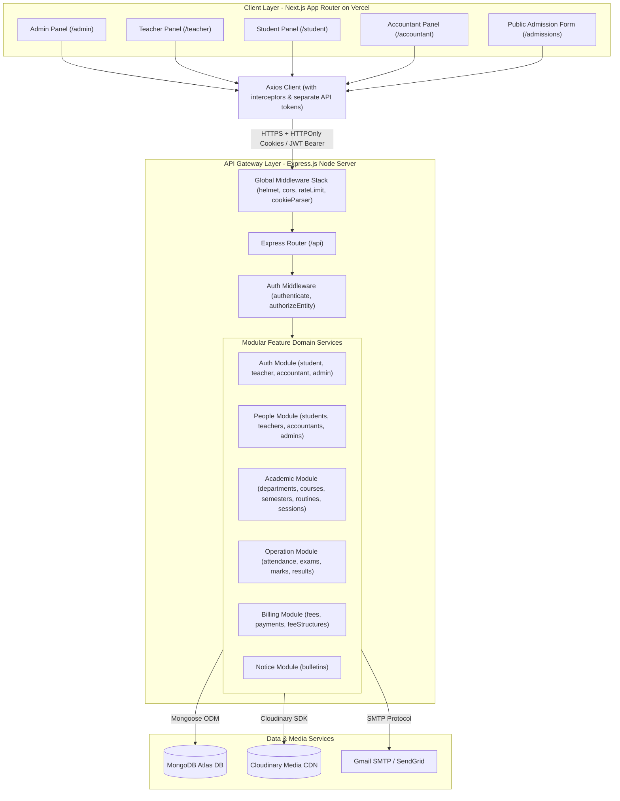
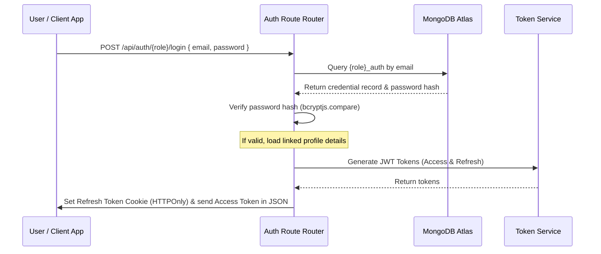
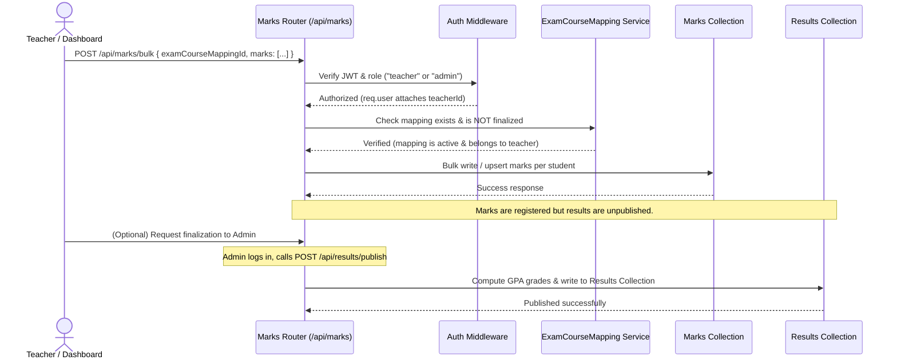

# System Architecture - Diploma Institute Management System (DIMS)

This document describes the design, topology, database structure, and communication protocols of the **Diploma Institute Management System (DIMS)**.

---

## 1. High-Level Architecture Topology

DIMS is built as a decoupled, multi-tier web application consisting of a static client (Vercel), a stateless REST API backend (Render/Railway), and a cloud database service (MongoDB Atlas).



---

## 2. Frontend Architecture

The frontend is built on **Next.js 16 (App Router)** and designed to completely isolate dashboard scopes based on roles. There are no shared user models: Admin, Student, Teacher, and Accountant are treated as distinct entities.

### Key Framework Features
- **App Router:** Organizes files into route groupings `(admin)`, `(teacher)`, `(student)`, `(accountant)`, `(auth)`, and `(public)`. This isolates layouts and routes.
- **Zustand State Management:** Implements individual, entity-scoped slices of store state for auth tokens and active profile records, preventing state pollution.
- **TanStack Query (React Query v5):** Manages API data fetching, synchronization, validation, caching, and loading/error states.
- **Axios Instances:** Employs four separate API clients configured with interceptors to inject appropriate headers and handle role-based silent token refreshes.
- **Tailwind CSS v4 & shadcn/ui:** Utility-based styles integrated with Radix primitive components to present a fully responsive dashboard UI.

---

## 3. Backend Architecture

The backend is built as an **Express.js** application, enforcing a strict **feature-module architecture**.

### Core Architecture Rules
- **Module Isolation:** Modules are fully self-contained. Rather than importing mongoose models or controllers across module borders, modules communicate by passing reference IDs (e.g., `studentId`, `courseId`) through parameters and checking existence via service-level helper functions.
- **ESModules:** Uses standard ESModule syntax (`import`/`export`) with Node 18+ runtime conventions.
- **Controller-Service Pattern:** Separates routing (routes file), request validation/payload reading (controller), and business logic/database execution (services).
- **Global Error Handling:** Implements an `ApiError` class and an async handler wrapper (`asyncHandler.js`) to capture and return clean, structured JSON envelopes for all failures, avoiding unhandled promise rejections.

---

## 4. Directory Layouts

### Backend Directory Layout
```
backend/
├── src/
│   ├── config/              # Server env and service config validations
│   ├── middlewares/         # Global middleware chains (CORS, Helmet, RateLimiter, JWT)
│   ├── modules/             # Entity-based domain folders
│   │   ├── auth/            # Scoped login routes, services, and schemas
│   │   ├── students/        # Student profiles, listings, and CRUD
│   │   ├── teachers/        # Teacher assignments, details, and profiles
│   │   ├── departments/     # Institutional department setups
│   │   └── ...              # Other modules
│   ├── routes/              # Central index router mounting all module routers
│   ├── utils/               # Common helper logic (email, pagination, GPA calculations)
│   └── app.js               # Express application initialization
└── server.js                # Server entrypoint listener
```

### Frontend Directory Layout
```
frontend/
├── src/
│   ├── app/                 # App Router grouping panels and layouts
│   │   ├── (admin)/         # Admin dashboard modules
│   │   ├── (teacher)/       # Teacher grade and attendance sheets
│   │   ├── (student)/       # Student result cards and ledger status
│   │   ├── (accountant)/    # Invoice processing
│   │   ├── (auth)/          # Scoped login panels
│   │   └── (public)/        # Public-facing routes (Admissions)
│   ├── components/          # Reusable UI widgets and layout views
│   ├── hooks/               # Custom hooks mapping TanStack Queries
│   ├── services/            # API call modules (Axios configs)
│   ├── store/               # Zustand slices
│   └── types/               # TypeScript interfaces
```

---

## 5. Database Architecture & Relationships

DIMS utilizes MongoDB Atlas with Mongoose. The database is design-partitioned into two logical boundaries: Credentials (Auth) and Profile/Operations (Domain).

```
admissions ──(on approval)──────────────────────→ students
                                                       │
                       ┌───────────────────────────────┤
                       │                               │
              student_auth                   ┌_________┼__________┐
              { studentId → students._id }   │         │          │
                                        attendances  results     fees
                                             │         │          │
                                        courseId   examId    feeStructureId
                                             │         │
                                           courses    exams
                                             │         │
                                        departmentId courseId
                                             │
                                         departments
                                             │
                                        headTeacherId
                                             │
                                           teachers
                                             │
                                        teacher_auth
                                        { teacherId → teachers._id }

admins ──→ admin_auth { adminId → admins._id }
accountants ──→ accountant_auth { accountantId → accountants._id }
```

### Collection Schemas & Keys
- **student_auth, teacher_auth, accountant_auth, admin_auth:** Handle credentials, password hashing, and token refresh records.
- **students:** Profile data (photo, roll, section) linked to `departmentId`, `semesterId`, and `academicSessionId`.
- **teachers:** Contact details and department designations.
- **departments:** Name, code, and `headTeacherId`.
- **courses:** Title, syllabus code, credit weights, and `departmentId`.
- **classroutines:** Subject hours, days, rooms, and teacher assignments.
- **attendances:** Record arrays referencing student statuses (present, absent) mapped under an attendance session.
- **exams & marks:** Score collections mapping performance grades.
- **fees & payments:** Payment receipts, waiver percentages, and collection records.

---

## 6. Authentication & Authorization Flows

### Authentication Sequence


### Authorization Workflow
1. **authenticate:** Middleware parses the request's Authorization header (Bearer token) or HTTPOnly cookies, verifies the JWT signature, and attaches the parsed claims (`req.user = { entityId, entityType, role }`) to the request context.
2. **authorizeEntity(...allowedRoles):** Verifies that `req.user.entityType` or `req.user.role` matches the expected permissions (e.g., rejects with `403 Forbidden` if a student attempts to call an admin-scoped route).
3. **authorizeOwner:** Service-layer check that verifies if the requesting entity owns the resource (e.g., checks if `req.user.entityId` matches the `studentId` on a grades or invoice lookup request).

---

## 7. Data Flow: Recording Exam Grades

This flow diagram demonstrates the multi-step module interactions involved when a Teacher records marks for a course:


